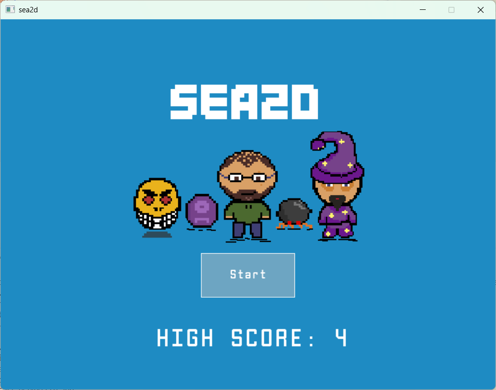
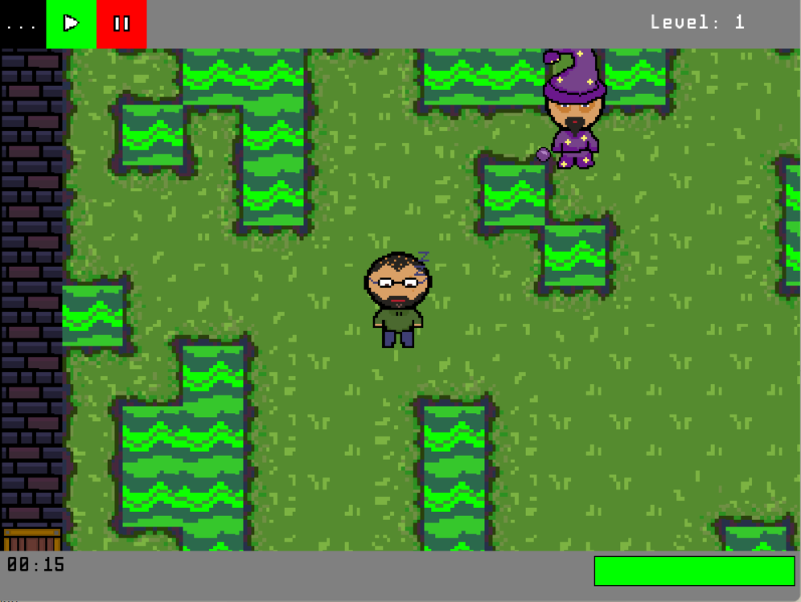

# Sea2d
Avtorja projekta: Bor Brudar, Lara Velkavrh

Avtorica glasbe: Patricija Femc

## Navodila za uporabo 

Program lahko zaženete kot strežnik, odjemalec ali oboje hkrati z ukazi `cargo r server`, `cargo r client` ali preprosto `cargo r`, glede na primer. Ukaz za odjemalca sprejme neobvezen argument – IP naslov in port, na katera
se poskusi povezati, ločena z dvopičjem, npr. `cargo r client 127.0.0.1:6000`. Če poganjate lokalno (localhost), je privzet port 6000.

Ne pozabite imeti nameščenih razvojnih različic (devel) `SDL2` in `SDL2_image`, sicer programa ne boste mogli prevesti. Enako velja za
`SDL2_mixer` in pa `SDL2_ttf`.

* Arch Linux: `sudo pacman -S sdl2-compat sdl2_image sdl2_mixer sdl2_ttf`.
* Ubuntu: `sudo libsdl2-dev ibsdl2-image-dev libsdl2-mixer-dev lidsdl2-ttf-dev`.
* Windows: razpakirajte datoteke v mapi `windows_dependencies` in kopirajte datoteke .lib in .dll za SDL2 in SDL2_image v direktorij, kjer je `Cargo.toml`, pa tudi v mapo `target/`.

Uporabniki drugih operacijskih sistemov – srečno. (Žal, poskušal sem urediti Dockerfile za ta namen, ampak potrebuje GUI passthrough, tako da je več težav kot je vredno. Sicer se prevede, tako da neustrašni lahko poskusijo tudi na ta način, Dockerfile je priložen. Ukaza sta `docker build -t sea2d-image .` in pa `docker run --rm sea2d-image`.) Priporočam uporabo virtualnih mašin.

Dokumentacijo se lahko generira z `cargo d`, testi pa se poženejo z `cargo t`.

## Opis projekta:

2D igra v pixel-art stilu. Spustite se čim globlje v zemljo in premagajte nasprotnike. Vsaka stopnja je najključno generirana z uporabo algoritma WFC (wave-function collapse), zato je vsaka izkušnja unikatna. Podpora za već igralcev je žal v povojih, kjer bo tudi ostala. 

