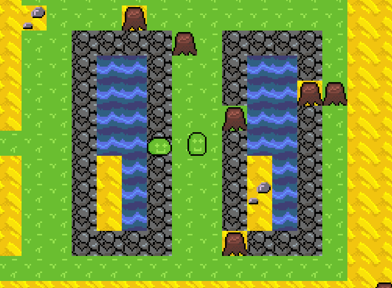

# sea2d
Avtorja projekta: Bor Brudar, Lara Velkavrh

## Navodila za uporabo 

Program lahko zaženete kot strežnik, odjemalec ali oboje hkrati z ukazi `cargo r server`, `cargo r client` ali preprosto `cargo r`, glede na primer. Ukaz za odjemalca sprejme neobvezen argument – IP naslov in port, na katera naj se poskusi povezati, ločena z dvopičjem, npr. `cargo r client 127.0.0.1:6000`. Če poganjate lokalno (localhost), je privzet port 6000.

Ne pozabite imeti nameščenih razvojnih različic `SDL2` in `SDL2_image`, sicer programa ne boste mogli prevesti.
Uporabniki Arch Linuxa: `sudo pacman -S sdl2-compat sdl2_image`
Uporabniki Windows: razpakirajte datoteke v mapi `windows_dependencies` in kopirajte datoteke .lib in .dll za SDL2 in SDL2_image v direktorij, kjer je `Cargo.toml`, pa tudi v mapo `target/`.

Uporabniki Maca – srečno. 

Teste poženete z `cargo t`, dokumentacija pa se prevede z ukazom `cargo doc`.
Obe poženete z vrha direktorija.

## Opis projekta:

2D igra v pixel-art stilu. Spustite se čim globlje v zemljo in premagajte nasprotnike. Vsaka stopnja je najključno generirana z uporabo algoritma WFC (wave-function collapse), zato je vsaka izkušnja unikatna. Multiplayer podpora je žal v povojih, kjer bo tudi ostala. 

